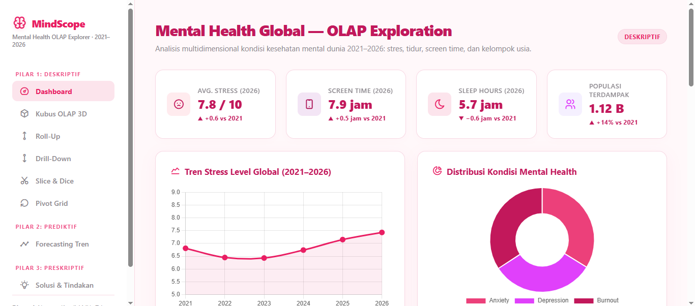

# 🧠 MindScope — Mental Health Global OLAP Explorer

> **Platform Analisis Multidimensional Kesehatan Mental Global 2021–2026**

MindScope adalah aplikasi **Business Intelligence dan Data Analytics** yang dirancang untuk mengeksplorasi kondisi kesehatan mental secara global melalui pendekatan **OLAP (Online Analytical Processing)**.

Aplikasi ini menganalisis beberapa indikator utama, seperti **tingkat stres, screen time, durasi tidur, kelompok usia, serta kondisi mental health** dari tahun 2021 hingga 2026.

MindScope tidak hanya menyediakan visualisasi data, tetapi juga dilengkapi dengan fitur **OLAP Exploration, Predictive Analytics, dan Prescriptive Analytics** untuk membantu pengguna memahami pola data, melihat kemungkinan tren, serta memperoleh insight dan rekomendasi berdasarkan hasil analisis.

---

## 🎯 Tujuan Project

MindScope dikembangkan untuk membantu pengguna melakukan eksplorasi data kesehatan mental secara lebih interaktif dan multidimensional.

Tujuan utama aplikasi ini adalah:

- 📊 Menganalisis kondisi kesehatan mental global berdasarkan periode waktu.
- 🧠 Mengidentifikasi perubahan tingkat stres dari tahun ke tahun.
- 📱 Menganalisis penggunaan screen time.
- 😴 Menganalisis durasi tidur.
- 👥 Membandingkan kondisi berdasarkan kelompok usia.
- 🔄 Melakukan eksplorasi data menggunakan konsep OLAP.
- 📈 Menganalisis dan memprediksi tren data.
- 💡 Menyediakan insight serta rekomendasi berdasarkan hasil analisis.

---

# ✨ Fitur Aplikasi

## 📊 1. Dashboard

Dashboard utama menampilkan ringkasan kondisi kesehatan mental global dalam bentuk **KPI, grafik, dan visualisasi interaktif**.

Informasi yang ditampilkan antara lain:

- Average Stress
- Average Screen Time
- Average Sleep Hours
- Populasi yang terdampak
- Tren Stress Level 2021–2026
- Distribusi kondisi Mental Health

### Preview



---

## 🧊 2. Kubus OLAP 3D

Fitur **Kubus OLAP 3D** digunakan untuk melihat data kesehatan mental berdasarkan beberapa dimensi secara bersamaan.

Dimensi yang dapat digunakan meliputi:

- Tahun
- Kelompok usia
- Negara/wilayah
- Stress Level
- Sleep Hours
- Screen Time
- Kondisi Mental Health

Fitur ini membantu pengguna memahami data dari berbagai perspektif.

<p align="center">
  
</p>

---

## 🔼 3. Roll-Up

Fitur **Roll-Up** digunakan untuk melakukan agregasi data dari tingkat yang lebih detail ke tingkat yang lebih umum.

Contohnya:

```text
Tahun → Negara → Kelompok Usia
